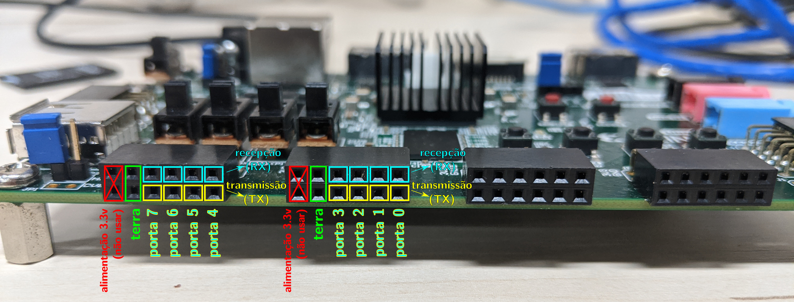
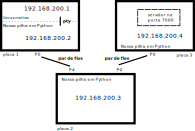

# Introdução

Neste trabalho, vamos juntar todas as camadas que implementamos até agora e depois testar o funcionamento em uma rede física real!


# Avaliação

Vocês deverão criar um vídeo curto **ou** um PDF de 1 a 3 páginas contendo as telas com os resultados obtidos e uma descrição sucinta do que foi feito. Se optarem por vídeo, **não precisam** aparecer todos os integrantes do grupo. Envie o vídeo ou PDF para o YouTube ou Google Drive e [submeta o link](https://forms.gle/FFG93xxwJDfhdSbW6).

A avaliação deste trabalho é manual, mas o critério de avaliação é uniforme:

 * **5 pontos**: tentou juntar o código dos trabalhos anteriores e simular localmente, mas não conseguiu e discutiu o que pode ter dado errado.

 * **6 pontos**: conseguiu juntar os códigos do T2, T3 e T4 e simular localmente o servidor de eco.

 * **7 pontos**: conseguiu juntar os códigos do T1, T2, T3 e T4 e simular localmente o servidor de IRC.

 * **9 pontos**: colocou os códigos do T2, T3 e T4 para funcionar nas placas Zybo Z7-20 e apresentou o servidor de eco funcionando.

 * **10 pontos**: colocou os códigos do T1, T2, T3 e T4 para funcionar nas placas Zybo Z7-20 e apresentou o servidor de IRC funcionando.


# Por que o grupo é de até 9 pessoas?

Para vocês terem a liberdade de testar várias implementações diferentes de T1, T2, T3 e T4, afinal esse trabalho consiste em juntar as diversas camadas.

As implementações não precisam estar perfeitas para funcionarem em conjunto:

 * Teoricamente, uma implementação de TCP passando até o teste do Passo 3 é suficiente para estabelecer uma conexão, trocar dados e comprovar o funcionamento. Uma implementação de TCP passando até o teste do Passo 4 deve funcionar quase perfeitamente, pois a nossa camada física é bastante confiável e tem probabilidade baixíssima de perder ou corromper pacotes.

 * Uma implementação de IP passando até o teste do Passo 3 deve funcionar bem se você não alterar as tabelas de encaminhamento fornecidas (se alterar, o Passo 4 é importante para evitar loops de roteamento). Você só vai precisar do Passo 5 do IP se quiser testar o mtr ou traceroute.

No entanto, a implementação de vocês pode ter erros que, por azar, não foram exercitados pelos testes automatizados. Portanto, dica valiosa: testem todas as combinações possíveis de implementações dos seus integrantes, até funcionar.


# Por que a Zybo Z7-20 e não um PC?

Nós configuramos a Zybo Z7-20 para disponibilizar 8 interfaces seriais em cada placa. Assim, conseguimos montar redes usando uma camada física simples e fácil de entender.




# Ambiente de trabalho

Montamos 2 mesas no laboratório de ensino do DC, cada uma com 3 placas dispostas na seguinte configuração:



As mesas não são conectadas entre si, então escolha uma das mesas para trabalhar e acesse as 3 placas dela para fazer os testes.

Como o ambiente é compartilhado, algumas **orientações gerais muito importantes**:

 * Antes de começar a trabalhar, observe se não há ninguém usando aquela placa naquele momento (use o comando `w`). Se tiver alguém usando, tente olhar as placas da outra mesa.

 * Se você usa `tmux` ou `screen`, não deixe nenhuma sessão detachada ao terminar de usar a placa, para deixar claro que aquela placa está livre.

 * Crie um diretório para o seu grupo trabalhar.

 * Não bisbilhote o diretório dos outros grupos.

Você pode acessar as placas de duas formas. Há um PC com AnyDesk já configurado no qual você pode conectar e de lá acessar as placas. Ou você pode acessar diretamente do seu próprio computador criando um arquivo `~/.ssh/config` com o seguinte conteúdo:

```
Host mesa1placa1
    HostName 200.18.97.240
    Port 58924
    User alarm
Host mesa1placa2
    HostName 200.18.97.137
    Port 58924
    User alarm
Host mesa1placa3
    HostName 200.18.97.76
    Port 58924
    User alarm
Host mesa2placa1
    HostName 200.18.97.247
    Port 58924
    User alarm
Host mesa2placa2
    HostName 200.18.97.164
    Port 58924
    User alarm
Host mesa2placa3
    HostName 200.18.97.57
    Port 58924
    User alarm
```

Uma vez dentro do PC com AnyDesk, ou uma vez configurado o seu próprio computador, utilize o seguinte comando, por exemplo, para acessar a placa 1 da mesa 1:

```
ssh mesa1placa1
```

Se pedir senha, utilize a senha que foi divulgada no Google Classroom.

Para copiar um arquivo para o diretório `~/meugrupo` da placa 1 da mesa 1:

```
scp arquivo mesa1placa1:~/meugrupo
```


# Instruções

Copie para o diretório do seu grupo, em cada placa, os arquivos:

 * [tcputils.py](https://github.com/thotypous/redes-t2-grader/blob/main/tcputils.py)
 * [iputils.py](https://github.com/thotypous/redes-t3-grader/blob/main/iputils.py)
 * [camadafisica.py](camadafisica.py)
 * Os arquivos `tcp.py`, `ip.py` e `slip.py` que vocês implementaram no T2, T3 e T4.

Copie também o executável principal que você vai executar em cada placa, respectivamente:

 * [placa1.py](placa1.py)
 * [placa2.py](placa2.py)
 * [placa3.py](placa3.py)

Execute o executável principal em cada placa.

Na placa 1, você vai ter que executar, em outros terminais (sem matar o Python!), alguns comandos que o executável principal vai indicar. Obs.: é normal aparecer uma vez a mensagem `BlockingIOError: [Errno 11] Resource temporarily unavailable` depois de executar o `slattach`.

Teste se o servidor de eco está funcionando: conecte-se a ele a partir da placa 1 executando `nc 192.168.200.4 7000`.

Se tiver problemas, pode ser útil fazer algumas simulações locais (veja os arquivos `exemplo_integracao.py` que foram fornecidos ao longo dos trabalhos anteriores), pois é mais fácil depurar localmente do que nas placas.

Uma vez com o servidor de eco funcionando, edite o arquivo `placa3.py` e tente inserir sua implementação de camada de aplicação do T1 (servidor de IRC).
